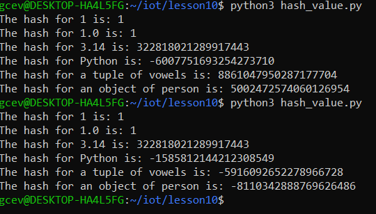
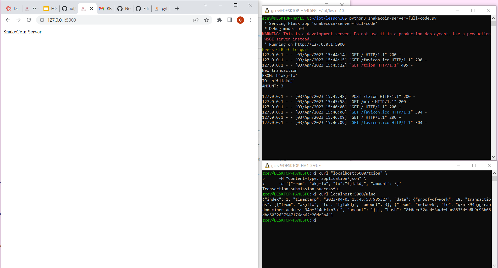
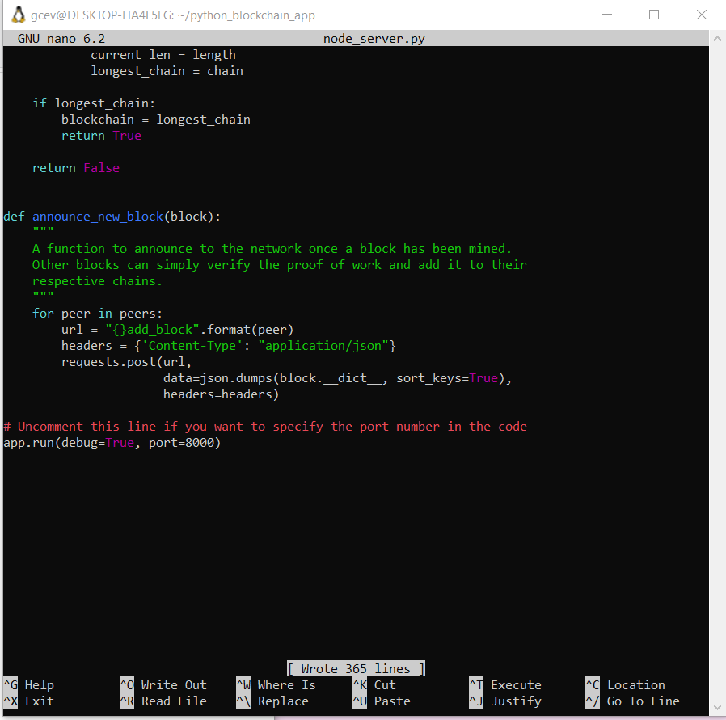
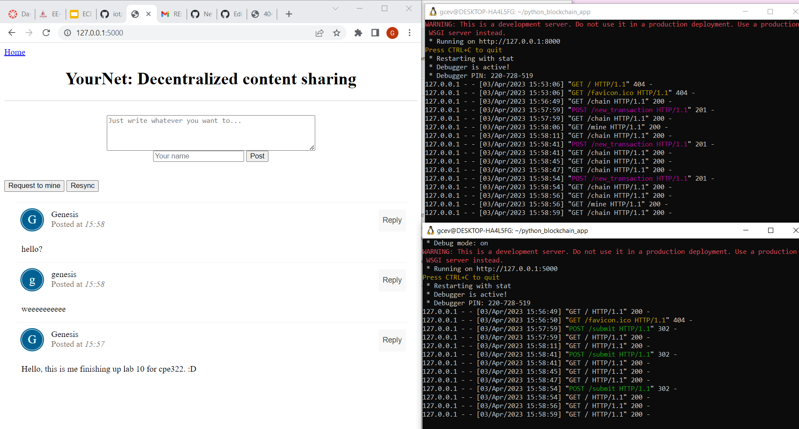

# Lab 10: Blockchain

## Procedure

### Ran hash_value.py twice and compared results:
First run:

### Ran snakecoin.py

### Ran snakecoin-server-full-code.py on Terminal 1 and mined a new block on Terminal 2

### Cloned Python blockchain app

### Uncommented the last line of node_server.py

### Ran node_server.py on Terminal 1 and run_app.py on Terminal 2

