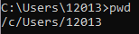

# Lab 2: Command Line

### Procedure

Below are the commands that were provided for this lab. Since I am not using a Linux machine, there will be an alternate version underneath containing the equivalent commands for Windows. The main differences are:
```$ man uname``` -> ```$ uname --help```
```$ ifconfig``` -> ```$ ipconfig```

Linux Commands:
```
$ hostname
$ env
$ ps
$ pwd
$ git clone https://github.com/kevinwlu/iot.git
$ cd iot
$ ls
$ cd
$ df
$ mkdir demo
$ cd demo
$ nano file
$ cat file
$ cp file file1
$ mv file file2
$ rm file2
$ clear
$ man uname
$ uname -a
$ ifconfig
$ ping localhost
$ netstat

```

Windows Commands:
```
$ hostname
$ env
$ ps
$ pwd
$ git clone https://github.com/kevinwlu/iot.git
$ cd iot
$ ls
$ cd
$ df
$ mkdir demo
$ cd demo
$ nano file
$ cat file
$ cp file file1
$ mv file file2
$ rm file2
$ clear
$ uname --help
$ uname -a
$ ipconfig
$ ping localhost
$ netstat

```

## Results

The following results will include the terminal command used, a screenshot of any available visual results, and a short description of what it does.

### ```$ hostname```


This command is used to display the host name portion of the full computer name of the computer. 

### ```$ env```


This command lists all of the environment variables.

### ```$ ps```


This command allows the user to check the status of active processes on a system.

### ```$ pwd```



This command writes to standard output the full path name of your current direction (from the root directory).

### Git cloning, Changing Directories, and Listing Files

```
$ git clone https://github.com/kevinwlu/iot.git
$ cd iot
$ ls 
$ cd
```


The "git clone" command clones the contents of the GitHub repository onto your system. 
The "cd" command means "change directory". It will change the directory to the next place in a path written after it.
The "ls" command lists the files of the current directory.

### ```$ df```


This command is used to view the amount of free diskspace on a server.

### ```$ mkdir demo```


The "mkdir" command stands for "make directory". This command is used to make a new folder at the user's current directory. In this instance, adding the "demo" after the command creates a folder named "demo".

### ```$ nano file```


The "nano file" command opens up a file named "file" in the terminal-based text editor, Nano. 

### ```$ cat file```


The "cat" command reads each file parameter in "file" one after the other and outputs it in the terminal.

### File Manipulation

```
$ cp file file1
$ mv file file2
$ rm file2
```


These command lines contain the commands for the following:
- "Copy": This command copies the first file to the second file. If no second file exists, it creates a file with the second file name. 
- "Move": This command overwrites the second file with the first file by moving its contents to the new destination. If no second file exists, it creates a file with the second file name. 
- "Remove": This command deletes the file named in the command line. 

### ```$ clear```


This command clears the terminal. 

### ```$ man uname``` Or ```$ uname --help```


This command outputs information about the Operating System, the system host name, or hardware to the standard output.

### ```$ uname -a```


This command prints all of the following information:
- Kernel name, release, and version
- Network node hostname
- Machine hardware name
- Processor type
- Hardware platform
- Operating system

### ```$ ipconfig``` Or ```$ ifconfig```


This command displays all current TCP/IP network configuration values and refreshes DHCP and DNS settings.

### ```$ ping localhost```


This command pings the local IP address. "Localhost" is the default name describing the local computer address a.k.a. the loopback address.

### ```$ netstat```


This command provides statistics about all active connections so you can find out which computers or networks a PC is connected to.

## What I Learned

This lab taught me about Nano, a simple terminal-based text editor, along with several terminal commands that can manipulate file directories. Before this assignment, I did not realize that Windows-equivalent Linux commands existed. I am planning on uploading my GitHub repository to my personal files and practice commands for tasks that I would usually execute in the browser. 
