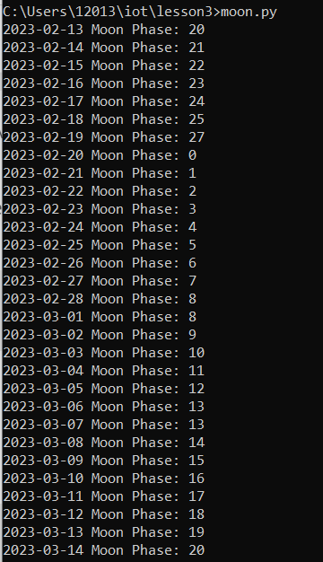
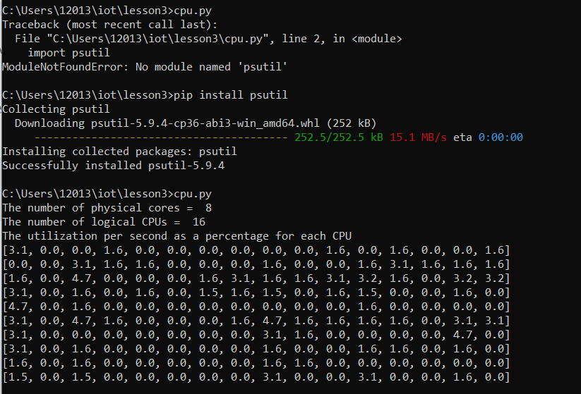

# Lab 3: Python

## Procedure

Before starting the lab, I had to download several packages in order to run the code featured in the [Lesson 3](https://github.com/kevinwlu/iot/tree/master/lesson3) folder. This was done by running:

```$ pip install [package name]```


Below are the commands that were used in this lab; I used the Windows version.

Linux:

```
$ python3 julian.py
$ python3 date_example.py
$ python3 datetime_example.py
$ python3 time_example.py
$ python3 sun.py 'New York'
$ python3 moon.py
$ python3 coordinates.py 'SC Williams Library'
$ python3 address.py '40.74480675, -74.02532862031404'
$ python3 cpu.py
$ python3 battery.py
$ python3 documentstats.py document.txt
```

Windows:

```
$ julian.py
$ date_example.py
$ datetime_example.py
$ time_example.py
$ sun.py "New York"
$ moon.py
$ coordinates.py 'SC Williams Library'
$ address.py "40.74480675, -74.02532862031404"
$ cpu.py
$ battery.py
$ documentstats.py document.txt
```

## Results

These are the results of running the Python files requested from the lab assignment. 

### julian.py


### date_example.py


### datetime_example.py


### time_example.py


### sun.py


### moon.py


### coordinates.py


### address.py


### cpu.py


### battery.py


### documentstats.py


## What I Learned

I learned that Windows cannot intrepret commands with single quotations.


