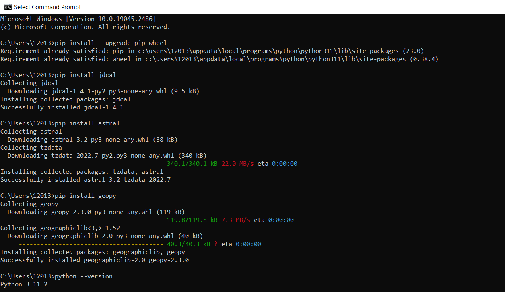

# Lab 4: Django and Flask

### Procedure

I first tried downloaded Django through Windows terminal, but instead updated my pip version since I was notified to do so. 

```$ python.exe -m pip install --upgrade pip```



After this, I downloaded the requested packages.

```
list packages here
```

Next, I installed the MariaDB server and client:


### Results

## What I Learned
