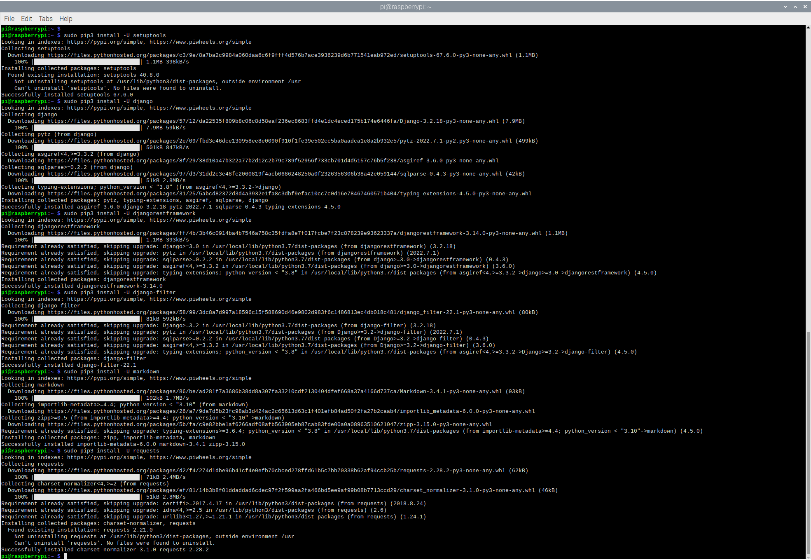
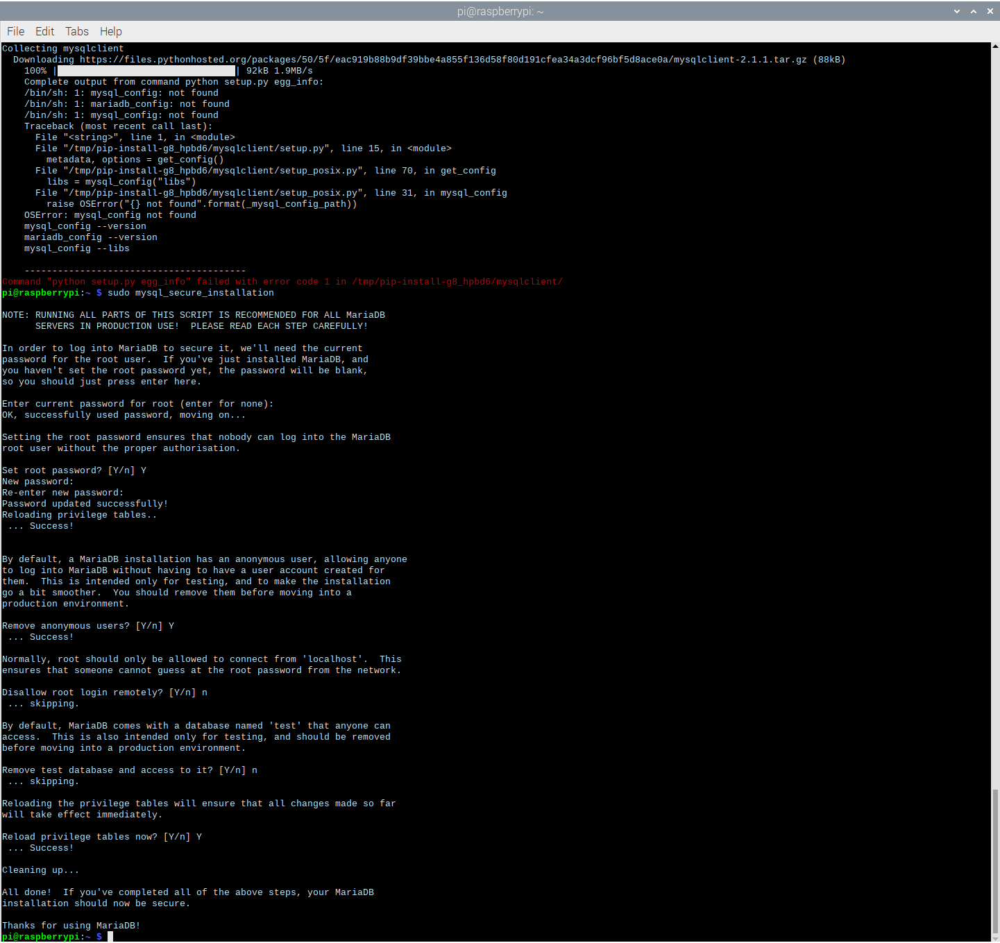
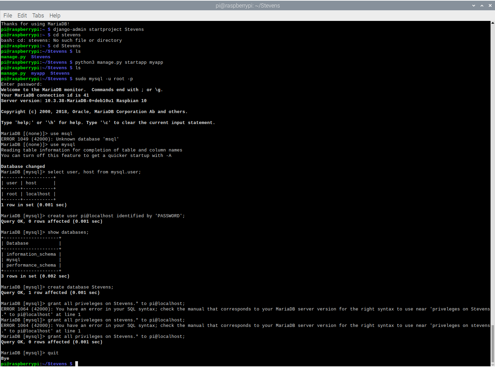
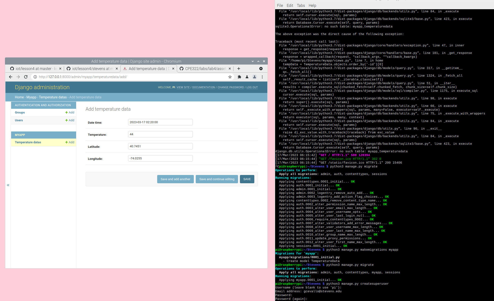
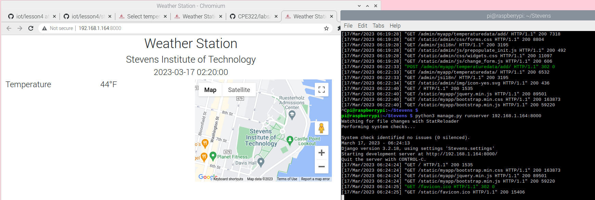
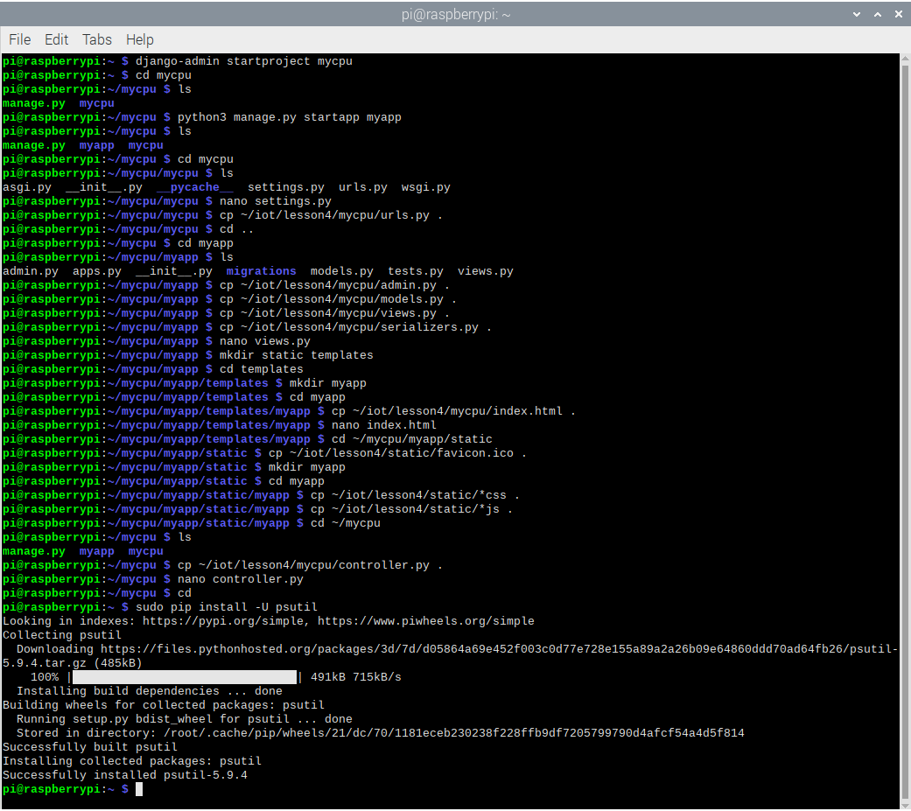
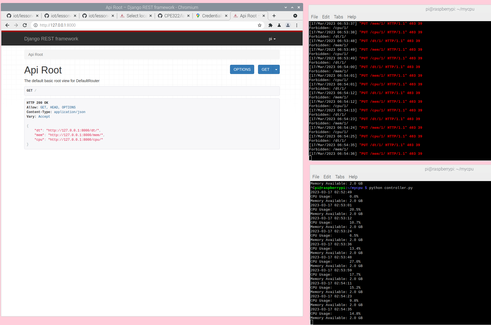
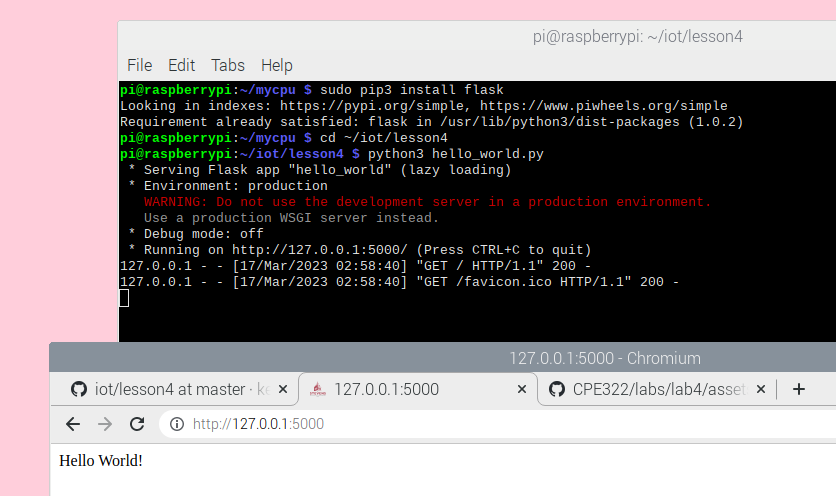

# Lab 4: Django and Flask

### Procedure

Installed Django and Django REST framework:

Used the default database, i.e., SQLite:

Started Django project "stevens," ran server, and viewed app:

Started Django REST project "mycpu," run server, and attempted to view app:

Ran Flask server via hello_world.py and view app:

