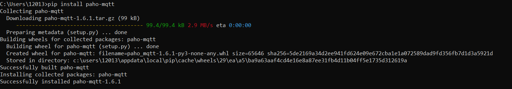
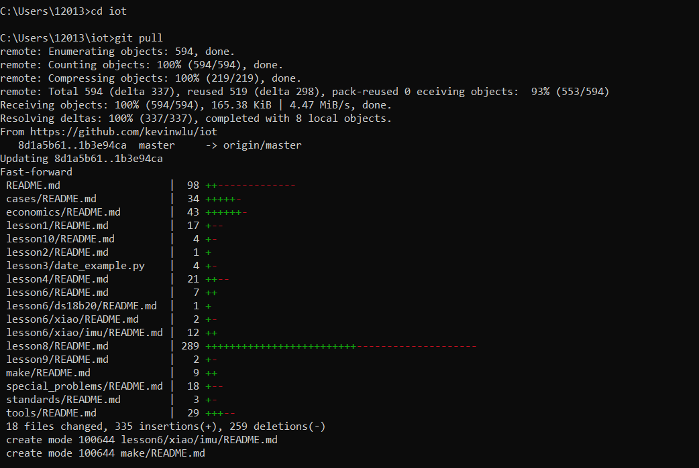
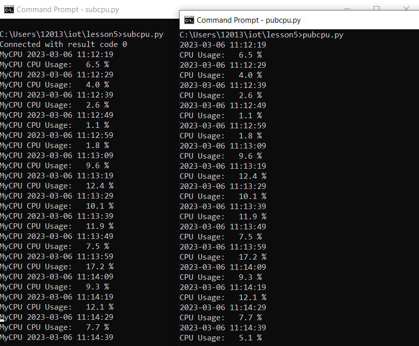

# Lab 5: Paho-MQTT

## Procedure

First, I installed Paho-MQTT on my Windows machine:

Then, I updated the IoT GitHub repository:

Finally, I ran the requested Python files on two separate terminals to compare results:

### subcpu.py and pubcpu.py

