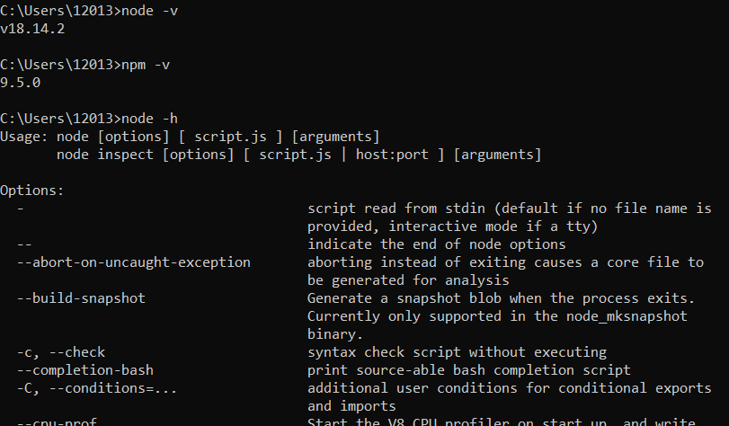
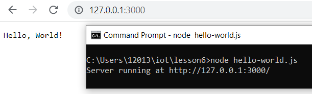
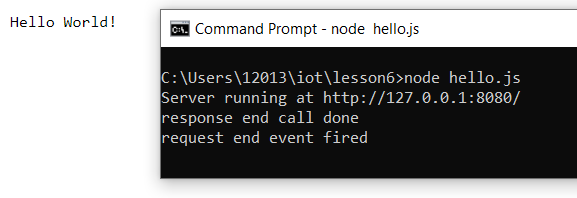
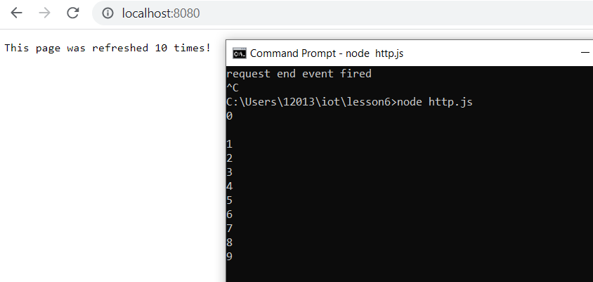
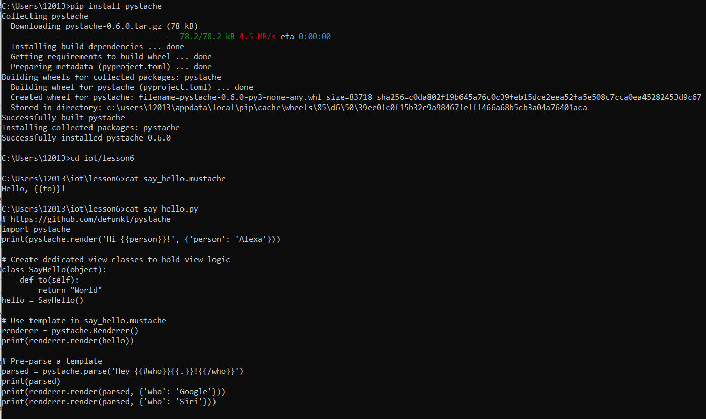
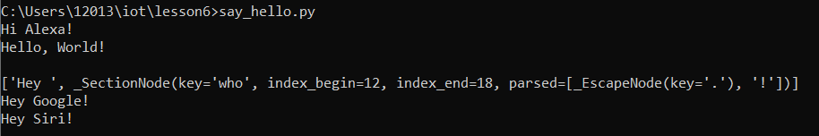

# Lab 6: Node.js and Pystache

## Procedure

First, I downloaded Node.js on my Windows machine.

Next, I ran several JavaScript files from the IoT GitHub repository: 

hello-world.js

hello.js

http.js

Then, I installed Pystache and  ran Python files:

say_hello.py (uses the template in say_hello.mustache)

