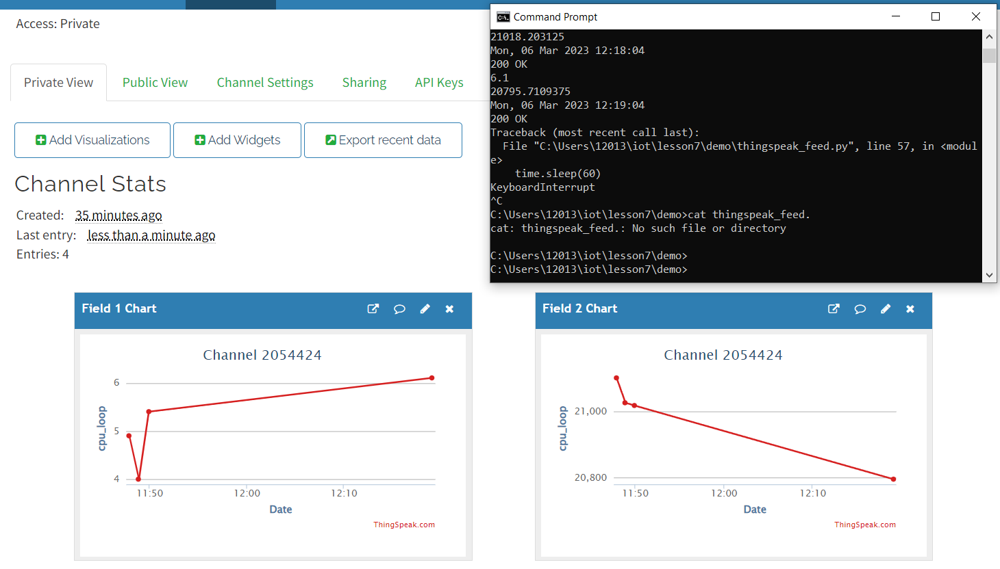

# Lab 7: ThingSpeak and Google Sheets

## Procedure

First, I signed up and logged into MathWorks ThingSpeak:

Then, I ran thingspeak_cpu_loop.py or thinkspeak_feed.py in a demo folder and copied thingspeak_feed.py and thingspeak_cpu_loop.py into it:

After running the programs and including the API key generated in ThingSpeak, I was able to see the result channels below.
It was interesting to see the spike in the CPU chart since I had the program running while closing my laptop and moving somewhere else:

(API KEY screenshots was edited out)

Next, I installed gspread and oauth2client:

After logging into the Google Cloud Platform Identity and Access Management, I created a project, "cpudata".
Then I enabled both Drive API and Sheets API and created/downloaded a service account JSON key file:

Finally, I started a new Google sheet cpudata, shared it with the client email in the JSON file and edited the necessary rows in cpu_worksheet.py:

Here are the results from running cpu_spreadsheet.py with the JSON key file in a demo folder:

