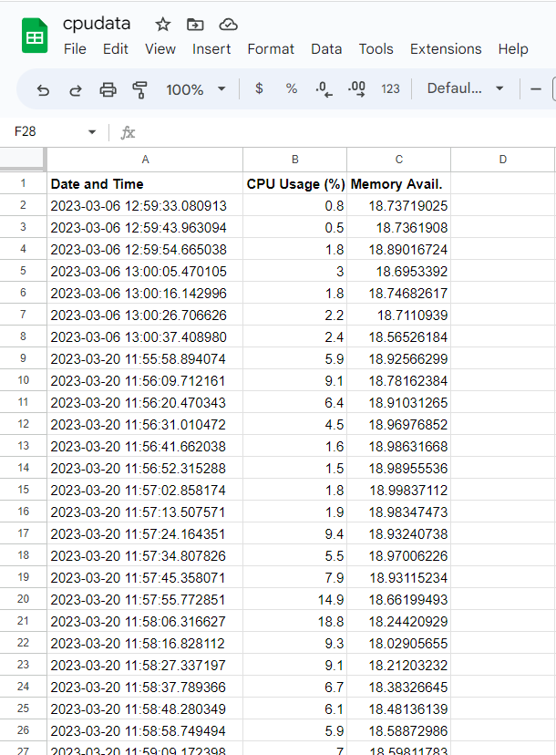
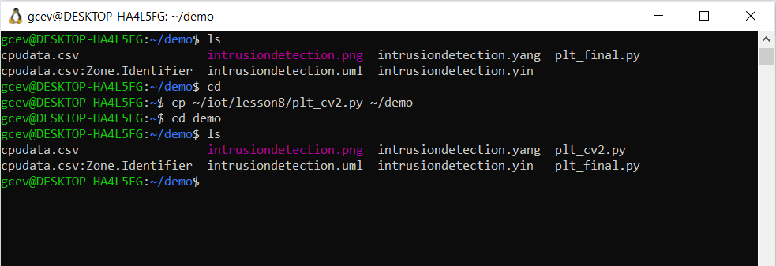
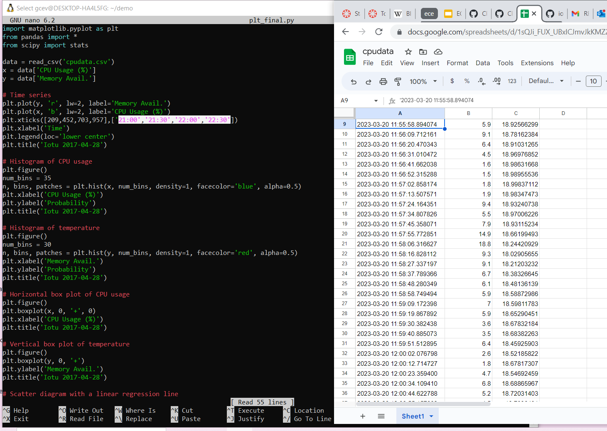
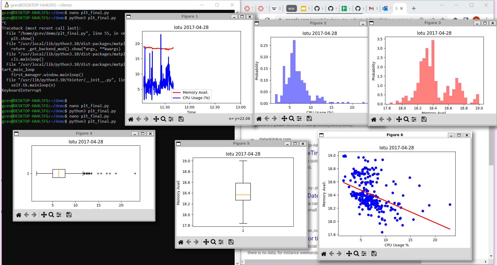
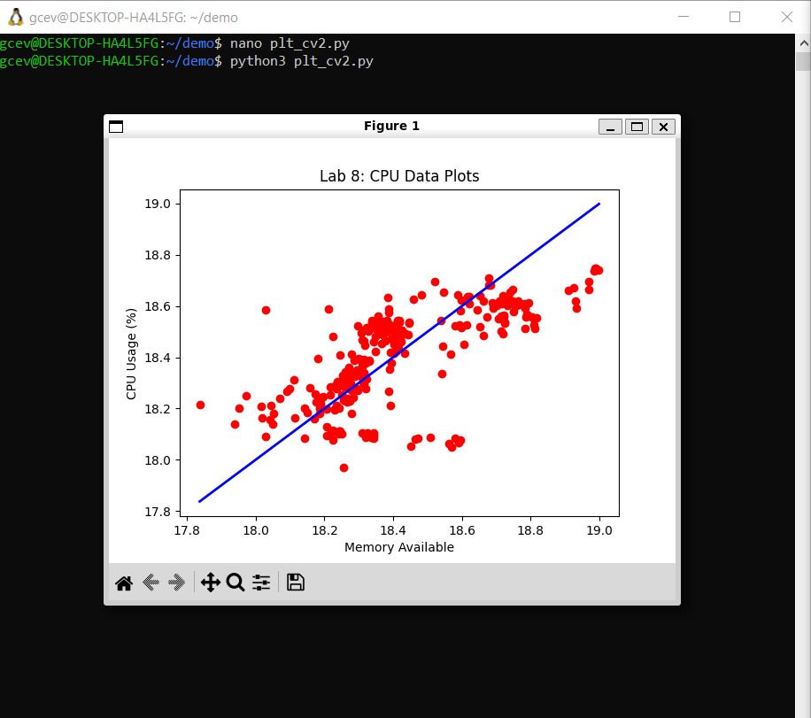

# Lab 8: Data Analysis

## Procedure

### Installed Python packages, saved the Lab 7 Google sheet in CSV format to ~/demo, and copied plt_final.py plt_cv2.py to same directory:

### Edited plt_final.py and plt_cv2.py with GNU nano to read the CSV file with customized plot titles:

### Ran plt_final.py and plt_cv2.py:

