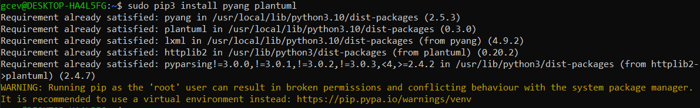
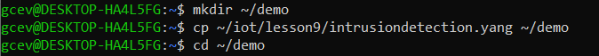
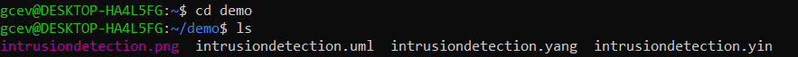
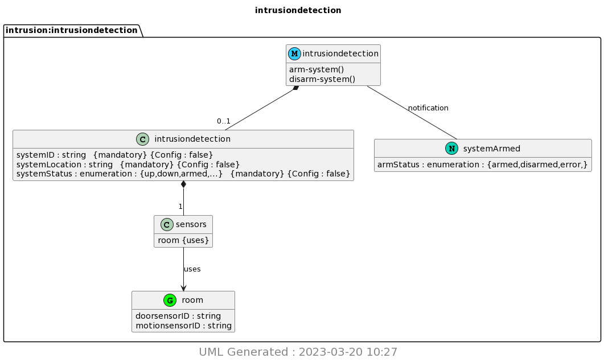

# Lab 9: YANG

## Procedure

### Installed pyang and PlantUML:


### Copied ~/iot/lesson9/intrusiondetection.yang to ~/demo:





### Ran pyang to generate intrusiondetection.yin and intrusiondetection.uml:

IntrusionDetection.yin

```
<?xml version="1.0" encoding="UTF-8"?>
<module name="intrusiondetection"
        xmlns="urn:ietf:params:xml:ns:yang:yin:1"
        xmlns:intrusion="http://netconfcentral.org/ns/intrusiondetection">
  <namespace uri="http://netconfcentral.org/ns/intrusiondetection"/>
  <prefix value="intrusion"/>
  <description>
    <text>YANG module for Intrusion Detection IoT system</text>
  </description>
  <revision date="2014-07-15">
    <description>
      <text>Intrusion Detection System</text>
    </description>
  </revision>
  <grouping name="room">
    <leaf name="doorsensorID">
      <type name="string"/>
      <description>
        <text>ID of door sensor in the room</text>
      </description>
    </leaf>
    <leaf name="motionsensorID">
      <type name="string"/>
      <description>
        <text>ID of motion sensor in the room</text>
      </description>
    </leaf>
  </grouping>
  <container name="intrusiondetection">
    <presence value="Indicates the service is available"/>
    <description>
      <text>Top-level container for all system objects.</text>
    </description>
    <leaf name="systemID">
      <type name="string"/>
      <config value="false"/>
      <mandatory value="true"/>
      <description>
        <text>ID of the system</text>
      </description>
    </leaf>
    <leaf name="systemLocation">
      <type name="string"/>
      <config value="false"/>
      <mandatory value="true"/>
      <description>
        <text>The location of the system</text>
      </description>
    </leaf>
    <leaf name="systemStatus">
      <type name="enumeration">
        <enum name="up">
          <value value="1"/>
          <description>
            <text>This is powered up</text>
          </description>
        </enum>
        <enum name="down">
          <value value="2"/>
          <description>
            <text>This is powered down</text>
          </description>
        </enum>
        <enum name="armed">
          <value value="3"/>
          <description>
            <text>This is armed</text>
          </description>
        </enum>
        <enum name="disarmed">
          <value value="4"/>
          <description>
            <text>This is disarmed</text>
          </description>
        </enum>
      </type>
      <config value="false"/>
      <mandatory value="true"/>
      <description>
        <text>This variable indicates the current state of
the system.</text>
      </description>
    </leaf>
    <container name="sensors">
      <uses name="room"/>
      <config value="false"/>
    </container>
  </container>
  <rpc name="arm-system">
    <description>
      <text>Arm the system</text>
    </description>
  </rpc>
  <rpc name="disarm-system">
    <description>
      <text>Disarm the system</text>
    </description>
  </rpc>
  <notification name="systemArmed">
    <description>
      <text>Indicates that system has been armed.</text>
    </description>
    <leaf name="armStatus">
      <description>
        <text>Indicates the system arming status</text>
      </description>
      <type name="enumeration">
        <enum name="armed">
          <description>
            <text>The system was armed.</text>
          </description>
        </enum>
        <enum name="disarmed">
          <description>
            <text>The system was disarmed.</text>
          </description>
        </enum>
        <enum name="error">
          <description>
            <text>The system is broken.</text>
          </description>
        </enum>
      </type>
    </leaf>
  </notification>
</module>

```

IntrusionDetection.uml

```
'Download plantuml from http://plantuml.sourceforge.net/
'Generate png with java -jar plantuml.jar <file>
'Output in img/<module>.png
'If Java spits out memory error increase heap size with java -Xmx1024m  -jar plantuml.jar <file>
@startuml img/intrusiondetection.png
hide empty fields
hide empty methods
hide <<case>> circle
hide <<augment>> circle
hide <<choice>> circle
hide <<leafref>> stereotype
hide <<leafref>> circle
hide stereotypes
page 1x1
Title intrusiondetection
package "intrusion:intrusiondetection" as intrusion_intrusiondetection {
class "intrusiondetection" as intrusiondetection << (M, #33CCFF) module>>
class "room" as intrusiondetection_I_room_grouping <<(G,Lime) grouping>>
intrusiondetection_I_room_grouping : doorsensorID : string
intrusiondetection_I_room_grouping : motionsensorID : string
class "intrusiondetection" as  intrusiondetection_I_intrusiondetection <<container>>
intrusiondetection *-- "0..1" intrusiondetection_I_intrusiondetection
intrusiondetection_I_intrusiondetection : systemID : string   {mandatory} {Config : false}
intrusiondetection_I_intrusiondetection : systemLocation : string   {mandatory} {Config : false}intrusiondetection_I_intrusiondetection : systemStatus : enumeration : {up,down,armed,...}   {mandatory} {Config : false}
class "sensors" as  intrusiondetection_I_intrusiondetection_I_sensors <<container>>
intrusiondetection_I_intrusiondetection *-- "1" intrusiondetection_I_intrusiondetection_I_sensors
intrusiondetection_I_intrusiondetection_I_sensors : room {uses}
intrusiondetection : arm-system()
intrusiondetection : disarm-system()
class "systemArmed" as intrusiondetection_I_systemArmed << (N,#00D1B2) notification>>
intrusiondetection -- intrusiondetection_I_systemArmed : notification
intrusiondetection_I_systemArmed : armStatus : enumeration : {armed,disarmed,error,}
}

intrusiondetection_I_intrusiondetection_I_sensors --> intrusiondetection_I_room_grouping : uses
center footer
 <size:20> UML Generated : 2023-03-20 10:27 </size>
 endfooter
@enduml

```

### Ran PlantUML to generate intrusiondetection.png:





